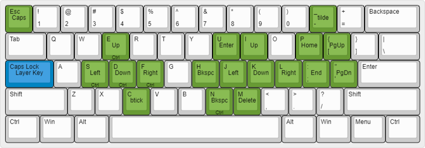

Turn CapsLock into a layer key using [AutoHotKey](https://www.autohotkey.com/). I tend not to use keyboard-specific software to create layers because I want to use the same layers regardless of which board I use, so modifying at the computer itself is the easiest way to do that. If you’re looking for ideas [this repository](https://github.com/stevep99/keyboard-tweaks) features a lot of changes.

## Usage

### Modify

You might be interested in changing what I’ve got.

`#If GetKeyState(...` is used to as a switch for CapsLock, and following that on each line is a mapping for a key to an [AutoHotKey Key](https://www.autohotkey.com/docs/v1/KeyList.htm).  Adding/modifying the layer is a matter of using the `[key]::[output]` syntax.

### Run at startup

To make it run, `Win + R` to open *Run*, and then use `shell:startup` to open a folder that contains files that will be opened/ran on startup. Copy a shortcut to cpslayer.ahk into that folder and the script will run at startup.

### Bugs

I have no idea exactly what causes it, but sometimes when using PyCharm it’s as if CapsLock gets held down and so when you go to type it ends up using the layer. I’ve learnt to live with it, but just a heads up.

## Rationale

Maybe I should justify why I’ve gone with the layout I have. The goal is simple — make high use keys accessible without having to move my hands. My hands are on the larger side, so arrow keys, Ctrl, and Delete are always a pain.

A laptop or my usual TKL layout have arrow keys, but when writing I’m not inclined to move my right hand to the arrow keys. Home-row or bust! If you’re gonna be as lazy as that, may as well go all the way: Backspace is also a half-nuisance.

The Ctrl bindings for arrow keys and Backspace are awesome. In case you didn’t know, Ctrl with arrow/Backspace will apply the move to entire words.